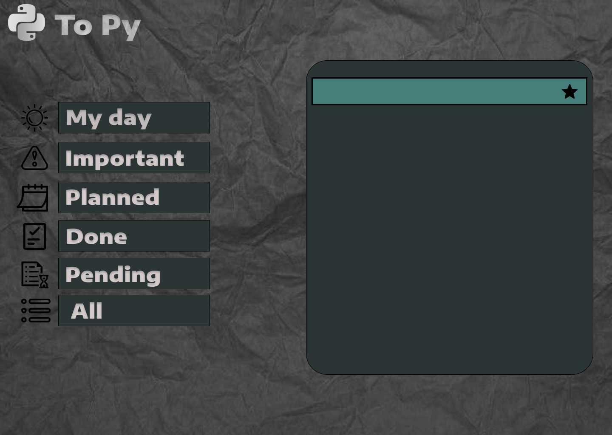

#**To Py**

  - To Py é uma aplicação de lista de tarefas ("to-do list") que permite que os usuários gerenciem suas tarefas diárias de forma simples e eficiente.

 
#**Funcionalidades**

  - Adicionar novas tarefas
  - Marcar tarefas como concluídas
  - Excluir tarefas
  - Visualizar todas as tarefas em uma lista
  - Filtrar tarefas por status (concluídas / não concluídas) e por data de vencimento

#**A aplicação To Py foi desenvolvida utilizando as seguintes tecnologias:**

  - Python 3
  - Tkinter (biblioteca gráfica do Python)
  - MySQL (banco de dados)
